# QFS Ecosystem System Map

> **Purpose:** Clear navigation between Product, Protocol, and Reporting layers.
> **Status:** Active Source of Truth

This map defines the boundaries between the different components sharing the "QFS" nomenclature.

## 🗺️ The Ecosystem at a Glance

```mermaid
graph TD
    User[User / Operator] --> Product[Layer 1: QFS Product]
    User --> Protocol[Layer 2: QFS × ATLAS Protocol]
    User --> Reports[Layer 3: NODE REPORTS]

    subgraph Product [Layer 1: Product Tools]
        direction TB
        QFS_Go[QFS Quick File Share]
        Note1[Standalone OSS Tool]
        Note2[File Sharing / URL Shortening]
    end

    subgraph Protocol [Layer 2: Protocol Infrastructure]
        direction TB
        Atlas[QFS × ATLAS]
        Gov[Governance Engine]
        PoE[Proof-of-Execution]
        Verification[Verification Tools]
    end

    subgraph Reports [Layer 3: System State]
        direction TB
        NodeReports[NODE REPORTS]
        Status[Live Progress]
        Previews[Future Features]
    end
```

---

## 1. QFS (Quick File Share) — The Product

**Standalone Go-based File Sharing Tool**

* **Scope:** User-facing utility for file transfer and URL shortening.
* **Repo Role:** Host for the OSS tool code (if applicable) or distinct repository.
* **Governance:** None (Standalone).
* **Key Doc:** `docs/PRODUCT/QUICK_FILE_SHARE_ANALYSIS.md` (Example path)

---

## 2. QFS × ATLAS — The Protocol

**Deterministic Governance & Economic Infrastructure**

* **Scope:** The core engine ensuring sovereign, verifiable governance.
* **Components:**
  * **Governance Engine:** Proposal life-cycle, voting, execution.
  * **PoE Layer:** Artifact generation, indexing, replay.
  * **AEGIS:** Coherence and invariant protection.
* **Key Docs:**
  * [README.md](/README.md) (Architecture)
  * [HOW_TO_AUDIT_QFS_V15.md](/HOW_TO_AUDIT_QFS_V15.md) (Verification)
  * [TESTNET_STATUS.md](/TESTNET_STATUS.md) (Live Network)

---

## 3. NODE REPORTS — The Pulse

**State Snapshots & Strategic Updates**

* **Scope:** Communication to paid members and operators about *what is happening now*.
* **Content:**
  * What is DONE.
  * What is EXECUTION-READY.
  * What is NEXT.
* **Key Doc:** `NODE_REPORTS/README.md` (or specific report files)

---

## 🧭 Navigation Heuristics

* **Looking for the file sharing app?** → Go to **Product**.
* **Auditing the governance system?** → Go to **Protocol**.
* **Checking project progress?** → Go to **Reports**.
