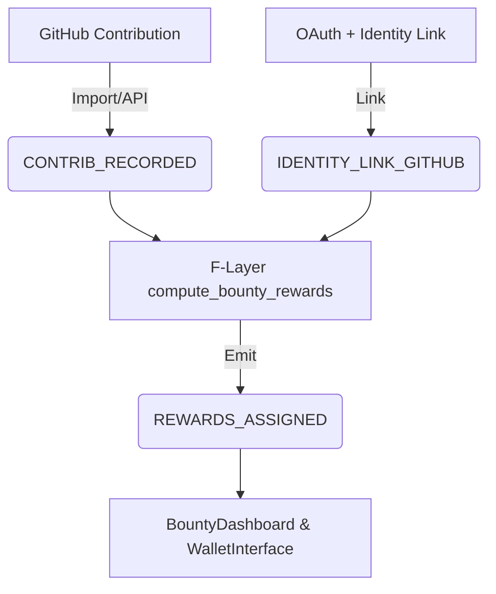

# V20 GitHub Integration & Retro Rewards — Timeless Roadmap

**Status:** Active / Continuous Integration
**Objective:** Fully deterministic end-to-end workflow from GitHub → EvidenceBus → FLX rewards

## 1. Key Principles

### Deterministic Computation

All reward allocations are computed from immutable EvidenceBus events. No ad-hoc changes.

### Full Traceability

Every contribution and reward is auditable and reconstructable.

### Immutable Evidence

- `IDENTITY_LINK_GITHUB` → wallet ↔ GitHub binding
- `CONTRIB_RECORDED` → contribution ledger
- `REWARDS_ASSIGNED` → deterministic FLX payouts

### Replayable Flows

Any auditor can replay the workflow to reproduce identical results.

### No Discretion

All authority flows through F-Layer computation; no subjective overrides.

## 2. Core Components

| Component | Purpose | Status |
| :--- | :--- | :--- |
| **Identity Linking** | Wallet ↔ GitHub binding | Complete (OAuth pending) |
| **Contribution Import Tool** | Generate contribution ledger | Complete |
| **Contribution Ingestion API** | Emit `CONTRIB_RECORDED` events | Complete |
| **Retro Rewards F-Layer** | Compute rewards from EvidenceBus | Complete |
| **UI Surfaces** | BountyDashboard / WalletInterface | Complete |
| **Event Schemas** | `IDENTITY_LINK_GITHUB`, `CONTRIB_RECORDED`, `REWARDS_ASSIGNED` | Complete |
| **GitHub OAuth** | Real-world authentication | **Pending** |
| **Reward Settlement & Claim** | Display & finalize rewards | **Pending** |
| **End-to-End Replay Test** | Validate with real data | **Pending** |

## 3. Phased Implementation

### Phase 1: Connect Real GitHub Data

**Goal:** Replace mock data with live GitHub OAuth and contribution ingestion

**Tasks:**

- Implement GitHub OAuth backend & frontend.
- Create rounds for contributions (start/end date + FLX pool).
- Import real contributions from GitHub into EvidenceBus.

**Outputs:**

- Verified `IDENTITY_LINK_GITHUB` events.
- Full `CONTRIB_RECORDED` ledger.
- Audit-ready contribution history.

### Phase 2: Compute & Display Retro Rewards

**Goal:** Transform evidence into deterministic FLX allocations

**Tasks:**

- Link wallets to GitHub via OAuth & wallet signature.
- Run reward computation for each round.
- Display rewards in:
  - BountyDashboard → Retro Rewards tab
  - WalletInterface → Reward history

**Outputs:**

- `REWARDS_ASSIGNED` events emitted.
- Rewards traceable to original contributions.
- UI reflects real-world FLX payouts.

### Phase 3: End-to-End Testing & Replay Validation

**Goal:** Ensure deterministic and reproducible behavior across environments

**Tasks:**

- Execute replay tests on real contribution history.
- Verify:
  - Event reconstruction
  - F-Layer computation accuracy
  - UI consistency
- Document audit trail for governance review.

**Outputs:**

- Bit-exact reproducibility.
- Confirmation of deterministic reward assignment.
- EvidenceBus + F-Layer correctness verified.

## 4. Repository Integration Recommendations

### Directory Structure

```
v20/
  api/
    github_oauth.py
  policy/
    bounty_github.py
  tools/
    github_import_contributions.py
  data/
    rounds/
    contrib_ledger_*.json
  tests/
    replay/
      test_github_retro_rewards.py
```

### Environment Variables

- `GITHUB_CLIENT_ID`
- `GITHUB_CLIENT_SECRET`
- `GITHUB_REDIRECT_URI`

### Versioning

- Keep GitHub integration independent from other F-Layer features.
- Tag releases with round IDs for traceability.

### Audit Hooks

- Every contribution emits `CONTRIB_RECORDED`.
- Every reward emits `REWARDS_ASSIGNED`.
- Wallet links emit `IDENTITY_LINK_GITHUB`.
- Replay tests must validate all three.

## 5. Long-Term / Timeless Considerations

- **Round Flexibility:** New rounds can be added without changing core logic.
- **Contribution Sources:** Additional Git providers (GitLab, Bitbucket) can plug in using the same EvidenceBus flow.
- **Cross-Chain Rewards:** FLX allocation remains F-Layer deterministic; backend source of truth is always EvidenceBus.
- **Auditor-Friendly:** All events, rewards, and linking are inspectable and replayable.
- **Immutable Error Handling:** Corrections via compensating events, not deletion.

## 6. Summary Flow



- **Deterministic**
- **Fully traceable**
- **Replayable**
- **Immutable**
