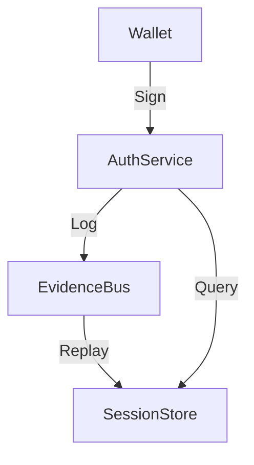

# Auth Architecture (v20)

**Overview:**
v20 introduces a hardened, deterministic authentication subsystems centralized around `AuthService`.

## Core Components

### 1. AuthService (Facade)

- **Role:** Single source of truth for all auth operations.
- **Responsibilities:**
  - Verify wallet signatures (Level 0 Authority).
  - Manage session lifecycle.
  - Emit EvidenceBus events.
  - Integrate PQC/Device checks.

### 2. Session Model

- **Structure:**

  ```typescript
  interface Session {
    session_id: string; // Deterministic: hash(counter + seed + wallet)
    subject_ids: {
      wallet: string;
      mockpqc?: string;
      oidc?: string;
    };
    device_id: string;
    scopes: string[];
    // ...
  }
  ```

- **Storage:** `SessionStore` (Append-only abstraction).

### 3. Authority Hierarchy

- **Level 0 (Identity):** Wallet Signatures, PQC Key derivation.
- **Level 1 (State):** EvidenceBus reconstructed state.
- **Level 2 (Advisory):** Device binding, MFA, OIDC.

## Diagram


