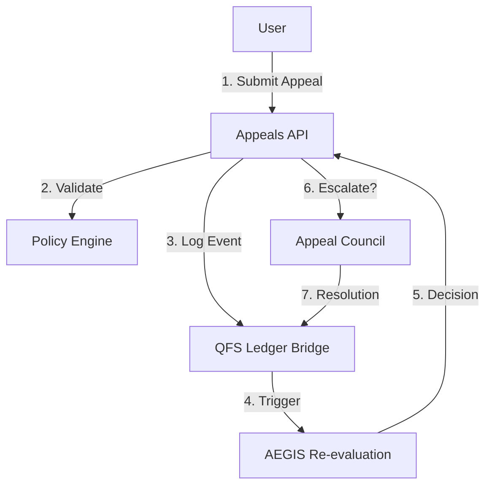

# QFS × ATLAS: Appeals API & Architecture

**Version:** 1.0

## 1. System Architecture



## 2. API Definition

### 2.1 Appeal Submission

#### `POST /api/v1/appeals`

Submit a new appeal.

- **Body**:

  ```json
  {
    "target_event_id": "ledger_event_123",
    "evidence_cid": "ipfs://Qm...",
    "reason": "User explanation"
  }
  ```

- **Response**: `{ "appeal_id": "..." }`

#### `GET /api/v1/appeals/{appeal_id}`

Retrieve appeal status and decision.

### 2.2 Council Operations

#### `GET /api/v1/appeals?status=pending`

List pending appeals for Council review.

#### `POST /api/v1/appeals/{appeal_id}/resolve`

Council member resolves an appeal.

- **Auth**: Requires Council signature.
- **Body**: `{ "decision": "ACCEPTED", "explanation_cid": "..." }`

## 3. Python Module Structure (`v13.services.appeals`)

- `manager.py`: CRUD for appeals.
- `reviewer.py`: Integration with AEGIS for re-evaluation.
- `council.py`: Council-specific operations.

## 4. Integration Points

- **v13.guards**: AEGIS re-evaluation hooks.
- **v13.ledger**: Logging appeal events.
- **v13.policy**: Validating appeal eligibility.
