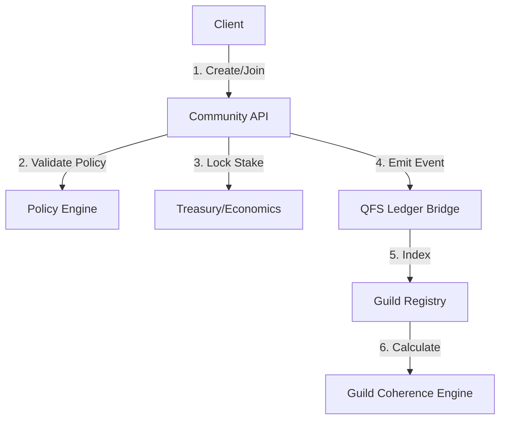

# QFS × ATLAS: Community API & Architecture

**Version:** 1.0

## 1. System Architecture

## 2. API Definition

### 2.1 Guild Management

#### `POST /api/v1/guilds`

Create a new Guild.

- **Body**: Manifest details.
- **Cost**: Processing fee + Initial seed stake.

#### `GET /api/v1/guilds/{guild_id}`

Retrieve Guild public details, stats, and coherence score.

#### `PUT /api/v1/guilds/{guild_id}`

Update Guild Manifest (Requires `Council` authority).

### 2.2 Membership

#### `POST /api/v1/guilds/{guild_id}/join`

Join a guild.

- **Logic**:
    1. Check user Coherence > Guild Threshold.
    2. Check user Balance > Staking Req.
    3. Execute Stake Lock.
    4. Grant Role.

#### `POST /api/v1/guilds/{guild_id}/leave`

Leave a guild and reclaim stake (subject to unbonding period).

### 2.3 Governance

#### `GET /api/v1/guilds/{guild_id}/proposals`

List active governance proposals for the guild.

## 3. Python Module Structure (`v13.services.community`)

- `manager.py`: CRUD operations for Guilds and Manifests.
- `membership.py`: Handling joins, leaves, and staking interactions.
- `governance.py`: Local proposal logic.
- `scoring.py`: Guild Coherence calculation logic.

## 4. Integration Points

- **v13.policy**: For validating join requirements.
- **v13.economics**: For managing treasury and stakes.
- **v13.importer/Feed**: For filtering content by Guild ID.
