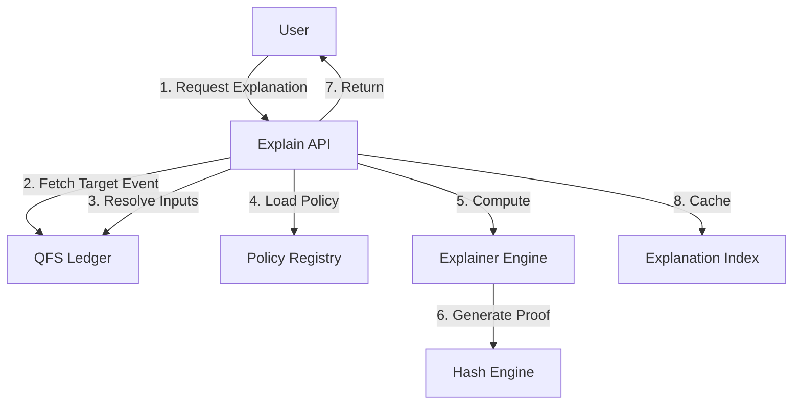

# QFS × ATLAS: Explain-This API & Architecture

**Version:** 1.0

## 1. System Architecture



## 2. API Definition

### 2.1 On-Demand Explanation

#### `GET /api/v1/explain/{entity_type}/{entity_id}`

Generate an explanation for a specific entity.

**Parameters:**

- `entity_type`: `reward`, `coherence`, `ranking`, `flag`, `policy_block`
- `entity_id`: The ledger event ID or user action ID

**Response:**

```json
{
  "id": "explain_...",
  "target_type": "REWARD",
  "target_id": "...",
  "inputs": [...],
  "computation": {...},
  "proof_hash": "..."
}
```

#### `GET /api/v1/explain/batch`

Batch explanation requests for performance.

**Body:**

```json
{
  "targets": [
    {"type": "reward", "id": "123"},
    {"type": "coherence", "id": "456"}
  ]
}
```

### 2.2 Recursive Drill-Down

#### `GET /api/v1/explain/{entity_type}/{entity_id}/tree?depth=3`

Returns a nested explanation tree for drill-down UX.

## 3. Python Module Structure (`v13.services.explainer`)

- `engine.py`: Core explanation generation logic.
- `resolvers.py`: Type-specific resolvers (reward, coherence, etc.).
- `proof.py`: Cryptographic proof generation.
- `cache.py`: Optional caching layer for performance.

## 4. Integration Points

- **v13.policy**: Load policy versions and computation rules.
- **v13.ledger**: Fetch historical events.
- **v13.policy.humor_explainability**: Integrate existing humor explanation logic.
- **v13.policy.value_node_explainability**: Integrate value node explanations.

## 5. Performance Targets

- Cold explanation: < 500ms
- Cached explanation: < 50ms
- Batch (10 items): < 1s
