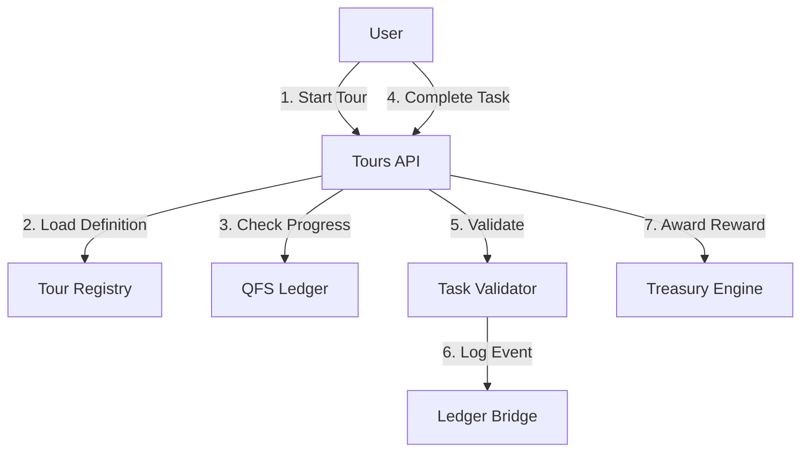

# QFS × ATLAS: Onboarding Tours API & Architecture

**Version:** 1.0

## 1. System Architecture



## 2. API Definition

### 2.1 Tour Management

#### `GET /api/v1/tours`

List available tours.

**Response:**

```json
{
  "tours": [
    {"id": "welcome_v1", "name": "Welcome Tour", "steps": 5}
  ]
}
```

#### `GET /api/v1/tours/{tour_id}`

Get full tour definition and user progress.

#### `POST /api/v1/tours/{tour_id}/start`

Start a tour (idempotent).

### 2.2 Progress Tracking

#### `GET /api/v1/tours/{tour_id}/progress`

Get current user's progress.

**Response:**

```json
{
  "tour_id": "welcome_v1",
  "completed_steps": ["step_1", "step_2"],
  "current_step": "step_3",
  "total_steps": 5,
  "completion_percentage": 40
}
```

#### `POST /api/v1/tours/{tour_id}/steps/{step_id}/complete`

Mark a step as completed (after validation).

## 3. Python Module Structure (`v13.services.onboarding`)

- `tours.py`: Tour definitions and registry.
- `progress.py`: User progress tracking.
- `validators.py`: Task completion validators.

## 4. Integration Points

- **v13.ledger**: Log tour progress events.
- **v13.economics**: Award completion rewards.
- **ATLAS UI**: Overlay components for tour presentation.
