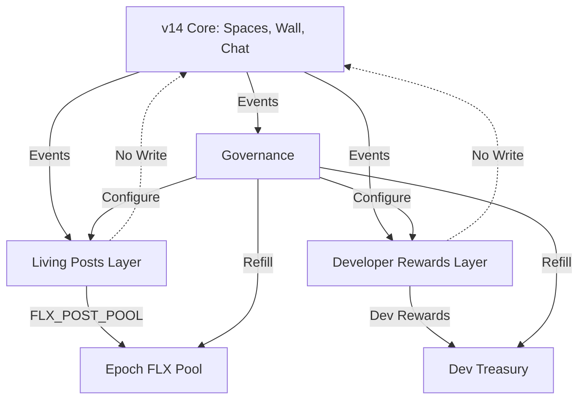

# QFS × ATLAS — v15 Full Execution Plan

**Version**: v15.0  
**Date**: 2025-12-18  
**Status**: Planning  
**Foundation**: v14.0 (frozen, replayable checkpoint)

---

## Constitutional Statement (v15)

v15 is an **additive validation and reward layer**.

- It does **NOT** alter, reinterpret, or override any v14 semantic, economic, or social rule.
- All v14 behavior remains valid, replayable, and economically identical with v15 fully disabled.
- v15 introduces:
  - A **Living Posts** engagement reward layer (HSMF-validated helpfulness)
  - A **Deterministic Developer Reward System** (bounties + ATR boosts)

Both are **parallel to v14** and consume only **pre-bounded treasuries**.

---

## I. Hard Invariants (Non-Negotiable)

### I.1 Semantic Invariance

v15 **must NOT**:

- Modify v14 math (CertifiedMath, BigNum128, HSMF)
- Modify v14 event meanings (Spaces, Wall, Chat)
- Modify v14 reward formulas (CHR/FLX for social actions)
- Modify v14 ledger state transitions
- Introduce implicit coupling between v14 and v15 logic

v15 **may ONLY**:

- Observe v14 events (read-only)
- Derive additional deterministic state (parallel)
- Emit **new additive events** (v15-specific)
- Distribute rewards from **isolated pools** (social FLX pools, dev rewards treasury)

### I.2 Determinism Invariance

Every v15 output must be:

- **Deterministic and replayable** from logs
- **Integer-math only** (`CertifiedMath`, `BigNum128`)
- **Free of wall-clock dependence** (epoch-based, not time-based)
- **Free of randomness** or probabilistic scoring

### I.3 Economic Isolation

- **Living Posts**: Draw only from `FLX_POST_POOL[epoch]`
- **Developer Rewards**: Draw only from `Dev Rewards Treasury`
- **Neither** modifies v14 social rewards or baseline emission schedules
- **No minting** introduced by v15; only redistribution from pre-funded pools

---

## II. v15 Conceptual Model

### II.1 Parallel State Layers

v15 introduces **two parallel layers**:

```
v14 (Frozen Baseline)
  ↓ (read-only)
v15 Layer A: Living Posts
  - Post-level helpfulness scores
  - Epoch-based FLX rewards
  - HSMF-validated engagement
  
v15 Layer B: Developer Rewards
  - Bounty-based FLX/CHR payouts
  - ATR reputation boosts
  - Bounded Dev Rewards Treasury
```

**Both layers**:

- Consume v14 events and governance decisions
- Maintain their own state (scores, bounty status, treasury balance, contributor profiles)
- **Never write back** into v14 state

### II.2 State Isolation Diagram



---

## III. Core v15 Primitive A: Living Posts

### III.1 Definition

A **Living Post** is a v14 `WallPost` with an associated v15 "helpfulness" state that can accrue rewards over multiple epochs.

- It is **NOT** a new post type
- It is a **v15 analytical overlay**
- v14 posts remain unchanged

### III.2 Post Helpfulness Vector

For each post \( p \), v15 maintains:

$$
H_p = \{ engagement\_score, coherence\_score, reputation\_weight \}
$$

**Computed solely from**:

- Logged v14 events (replies, likes, references)
- HSMF coherence outputs
- ATR / AEGIS tiers
- Epoch counters

**Properties**:

- **Monotonic in evidence**: More valid engagement → equal or higher components
- **NOT monotonic in time**: Old posts can still earn if helpful
- **Integer-scaled**: Stored outside `WallPost` in v15 state

### III.3 Deterministic Scoring Function

$$
score_p = f(engagement\_score, coherence\_score, reputation\_weight)
$$

**Constraints**:

- Uses `CertifiedMath` + `BigNum128`
- **No floats**, no hidden normalization
- **Composable and order-independent**
- Inputs strictly limited to:
  - v14 events: replies, likes, references
  - ATR / AEGIS tiers
  - HSMF coherence outputs
  - Epoch counters
- **No time-since-creation** or velocity metrics

**Candidate Form** (to be formalized):

$$
score_p = \text{CertifiedMath.imul}(
  engagement\_score,
  \text{CertifiedMath.imul}(coherence\_score, reputation\_weight)
)
$$

With:

- `engagement_score = sum(valid_replies * 10 + valid_likes * 1)`
- `coherence_score = HSMF_coherence_output` (0-1000 scale)
- `reputation_weight = min(1000, ATR / 10)` (capped)

### III.4 Epoch FLX Pools

For each epoch \( E \):

- `FLX_POST_POOL[E]` is a **fixed, pre-allocated amount**
- Post reward:

$$
reward_{p,E} = FLX\_POST\_POOL[E] \times \frac{score_{p,E}}{\sum_j score_{j,E}}
$$

**Guarantees**:

- Pool is **hard-capped** and governance-configurable
- Total FLX per epoch is **fixed**; no unbounded growth
- Posts can earn across **many epochs**, but cumulatively bounded by pool sums
- **No inflation**: Pools are pre-funded, not minted

### III.5 Post Lifecycle State Machine

**States**: `NEW → ACTIVE → TAPERING → ARCHIVED`

**Drivers**:

- Event counts (not time)
- Epoch progression
- HSMF validation outputs

**Behavior**:

- **NEW**: Collects evidence, no rewards (first epoch)
- **ACTIVE**: Eligible for full proportional rewards
- **TAPERING**: Deterministically decays `score_p` to prevent permanent dominance
  - Decay formula: `score_p_new = score_p * TAPER_FACTOR` (e.g., 0.9 per epoch)
  - Prevents old posts from dominating forever
- **ARCHIVED**: No further rewards, state remains for replay

**Transition Triggers**:

- `NEW → ACTIVE`: After first epoch with engagement
- `ACTIVE → TAPERING`: After N epochs (e.g., 10) or M total engagement (e.g., 1000)
- `TAPERING → ARCHIVED`: When `score_p < ARCHIVE_THRESHOLD` (e.g., 10)

---

## IV. Core v15 Primitive B: Developer Bounties

### IV.1 Bounty Schema (✅ Implemented)

**Location**: `v13/policy/bounties/bounty_schema.py`

**Components**:

- `Bounty` dataclass:
  - Deterministic fields: `bounty_id`, `scope`, `acceptance_criteria`
  - Fixed rewards: `reward_flx`, `reward_chr`
  - Anti-spam: `res_stake_required`
  - Impact tier: `minor` / `feature` / `core`
- `BountySubmission`:
  - Tracks: `contributor_wallet`, `pr_number`, `commit_hash`
  - Status: `PENDING` / `APPROVED` / `REJECTED`
- `ContributorProfile`:
  - Tracks: `total_atr`, `bounties_completed`, `contribution_history`

**Impact Tiers → ATR Boosts**:

- `minor` (docs, small fixes): **+10 ATR**
- `feature` (modules, services): **+50 ATR**
- `core` (math, Zero-Sim, governance): **+100 ATR**

### IV.2 Developer Events (✅ Implemented)

**Location**: `v13/policy/bounties/bounty_events.py`

**Event Types**:

- `dev_bounty_paid` – Deterministic reward payment
- `atr_boost_applied` – Non-transferable reputation increase
- `bounty_claimed` – RES stake lock event
- `res_stake_returned` – Stake unlock/refund
- `bounty_rejected` – Failure path with stake outcome
- `treasury_refill` – Governance-approved top-up

**All events**:

- v15-only (do not affect v14)
- Append-only (replayable)
- Include `bounty_id` + `commit_hash` for determinism

### IV.3 Dev Rewards Treasury (✅ Implemented)

**Location**: `v13/policy/treasury/dev_rewards_treasury.py`

**Features**:

- **Bounded reserves**: Default 10,000 FLX + 5,000 CHR
- **Deterministic payment**: Executes with `dev_bounty_paid` event
- **Depletion alerts**: 20% (low), 10% (critical)
- **Full history**: All payments and refills logged
- **Governance refill**: Requires approval + `treasury_refill` event

**Constitutional Compliance**:

- ✅ Bounded (no unbounded minting)
- ✅ Explainable (bounty ID + commit hash)
- ✅ Deterministic (fixed rewards)
- ✅ Zero-Sim compliant (replayable)

### IV.4 Bounty Lifecycle State Machine

**States**: `OPEN → CLAIMED → SUBMITTED → VERIFIED → PAID`

**Failure Paths**: `REJECTED`, `EXPIRED`

**Transitions**:

1. **OPEN → CLAIMED**: Contributor stakes RES
   - Event: `bounty_claimed`
   - RES locked
2. **CLAIMED → SUBMITTED**: PR opened
   - Links: `pr_number`, `commit_hash`
3. **SUBMITTED → VERIFIED**: CI green + acceptance criteria met
   - HSMF validation (Phase 2)
   - Manual review (Phase 1)
4. **VERIFIED → PAID**: Payment executed
   - Event: `dev_bounty_paid`
   - Event: `atr_boost_applied`
   - Event: `res_stake_returned`

**Rejection Path**:

- **SUBMITTED → REJECTED**: Criteria not met
  - Event: `bounty_rejected`
  - Event: `res_stake_returned` (good faith) or slashed (spam)

---

## V. HSMF Integration

### V.1 Engagement Validation Layer

**HSMF validates engagement quality, NOT content**:

**Filters using**:

- **ATR-weighted influence**: Higher ATR = more weight
- **AEGIS tier gating**: Tier 0 (banned) = 0 weight
- **Deterministic graph analysis**: Downweight farmed engagement (e.g., bot clusters)

**Invariant**:
> Invalid or low-quality engagement **cannot increase rewards**; at best, its own weight is discounted.

**Example**:

- User A (1000 ATR) likes Post P: `+10` engagement score
- User B (10 ATR, Tier 0) likes Post P: `+0` engagement score (filtered)
- User C (100 ATR, in bot cluster) likes Post P: `+1` engagement score (downweighted)

### V.2 HSMF Bounty Validation (Phase 2)

**Validates bounty completion**:

- **CI status**: All checks green (tests, Zero-Sim, regression)
- **Acceptance criteria**: Deterministic checks met
- **Constitutional compliance**: No v14 semantics changed

**Validation Rules** (`v13/policy/governance/hsmf_bounty_rules.py`):

```python
def validate_bounty_verification(
    bounty_id: str,
    pr_number: int,
    ci_status: Dict
) -> ValidationResult:
    """Validate bounty completion"""
    # Check CI green
    if not ci_status["all_checks_passed"]:
        return ValidationResult(valid=False, reason="CI failed")
    
    # Check Zero-Sim compliance
    if ci_status["zero_sim_violations"] > 0:
        return ValidationResult(valid=False, reason="Zero-Sim violations")
    
    # Check regression hash (if applicable)
    if bounty_requires_regression_check(bounty_id):
        if not ci_status["regression_hash_verified"]:
            return ValidationResult(valid=False, reason="Regression hash mismatch")
    
    return ValidationResult(valid=True)
```

---

## VI. Economic Isolation & Safety

### VI.1 Pool Isolation

**Living Posts**:

- Draw only from `FLX_POST_POOL[epoch]`
- No access to v14 social rewards
- No access to Dev Rewards Treasury

**Developer Rewards**:

- Draw only from `Dev Rewards Treasury`
- No access to v14 social rewards
- No access to Living Posts pools

**v14 Social Rewards**:

- Unchanged (Spaces, Wall, Chat events)
- No access to v15 pools

### VI.2 No Minting

- All v15 pools are **pre-funded**
- No new FLX/CHR minted by v15
- Refills require **governance approval**
- Refills emit `treasury_refill` or `pool_refill` events

### VI.3 Bounded Growth

**Living Posts**:

- Total FLX per epoch: `FLX_POST_POOL[E]` (fixed)
- Total FLX across all epochs: `sum(FLX_POST_POOL[E])` (bounded by governance)

**Developer Rewards**:

- Total FLX available: `Dev Rewards Treasury.flx_reserve`
- Total CHR available: `Dev Rewards Treasury.chr_reserve`
- Depletion alerts prevent over-allocation

---

## VII. Zero-Sim Contract v1.5

### VII.1 Extensions to v1.4

v1.5 **adds** to v1.4 (does not replace):

**Parallel State**:

- Living Posts state (`H_p`, `score_p`, lifecycle)
- Developer Rewards state (bounties, submissions, contributor profiles, treasury)

**Epoch Pools**:

- `FLX_POST_POOL[epoch]` configuration and distribution
- Bounded FLX emissions for posts

**Dev Rewards Treasury**:

- Treasury balance and payment history
- Bounty lifecycle and verification

**Replay Guarantees**:
Given:

- v14 event logs
- v15 configuration (epoch pools, treasury balances, scoring parameters)
- Governance changes

The system can **recompute exactly**:

- All `H_p` and `score_p` values
- All `post_helpfulness_updated` / `post_reward_distributed` events
- All bounty and dev reward events
- All treasury balances

### VII.2 New Determinism Requirements

**Living Posts**:

- `f(H_p)` must be:
  - Integer-only (`CertifiedMath`, `BigNum128`)
  - Order-independent (can process events in any order)
  - Composable (can split/merge computations)
- Epoch boundaries must be deterministic (block-based, not time-based)

**Developer Rewards**:

- Bounty rewards must be fixed at creation time
- Acceptance criteria must be deterministic and testable
- ATR boosts must be deterministic (impact tier → fixed delta)

---

## VIII. Governance Integration

### VIII.1 Governable Parameters

**Living Posts**:

- `FLX_POST_POOL[epoch]` - Pool size per epoch
- Scoring coefficients in `f(H_p)` - Weight of engagement vs coherence vs reputation
- PostRewardStateMachine thresholds:
  - `ACTIVE → TAPERING` trigger (epoch count or engagement threshold)
  - `TAPER_FACTOR` (decay rate)
  - `ARCHIVE_THRESHOLD` (minimum score)

**Developer Rewards**:

- Dev Rewards Treasury refill amounts and triggers
- ATR boost mappings for `impact_tier` (currently 10/50/100)
- Bounty approval process (maintainers vs governance)

### VIII.2 Governance Process

**All changes**:

1. Are **proposals** processed by `GovernanceStateMachine`
2. Emit **governance EconomicEvents**
3. Have **explicit activation epochs** (not immediate)
4. Are **logged and auditable**

**Example Proposal**:

```python
Proposal(
    proposal_id="PROP-2025-001",
    title="Increase FLX_POST_POOL to 5000 per epoch",
    changes={
        "FLX_POST_POOL": 5000  # Up from 3000
    },
    activation_epoch=150,  # Activates at epoch 150
    proposer="wallet_xyz",
    required_votes=100  # NOD threshold
)
```

---

## IX. Implementation Roadmap

### Phase 1: Manual Bounty System (v14.1) ✅ IN PROGRESS

**Timeline**: 2-3 weeks | **Effort**: 18 hours

**Status**: Foundation complete (schema, events, treasury)

**Remaining**:

- [ ] Create `BOUNTIES.md` registry
- [ ] Create `CONTRIBUTORS.md` tracking
- [ ] Write Phase 1 tests
- [ ] Document bounty process
- [ ] Launch first test bounty

**Deliverables**:

- ✅ Bounty schema
- ✅ Economic events
- ✅ Dev Rewards Treasury
- ⏳ BOUNTIES.md
- ⏳ Tests (100% coverage)
- ⏳ Documentation

### Phase 2: Living Posts Foundation (v15.0-alpha)

**Timeline**: 4-6 weeks | **Effort**: 40 hours

**Components**:

- [ ] Define `H_p` vector schema
- [ ] Implement `f(H_p)` scoring function
- [ ] Create `FLX_POST_POOL` management
- [ ] Implement PostRewardStateMachine
- [ ] Add HSMF engagement validation
- [ ] Write multi-epoch regression tests

**Deliverables**:

- Living Posts state layer
- Epoch-based FLX distribution
- HSMF engagement filters
- Regression scenarios
- Zero-Sim v1.5 contract update

### Phase 3: Governance Automation (v15.0-beta)

**Timeline**: 4-6 weeks | **Effort**: 26 hours

**Components**:

- [ ] Add bounty transitions to GovernanceStateMachine
- [ ] Implement HSMF bounty validation rules
- [ ] Automate bounty verification
- [ ] Integrate with CI
- [ ] Add governance parameter updates

**Deliverables**:

- Automated bounty processing
- HSMF-validated verification
- Governance-driven configuration
- Full integration tests

### Phase 4: NOD Integration (v16.0)

**Timeline**: 2-3 weeks | **Effort**: 17 hours

**Components**:

- [ ] Implement NOD multipliers for contributors
- [ ] Add multiplier tracking
- [ ] Integrate with validation
- [ ] Test bounded rewards

**Deliverables**:

- Contributor NOD multipliers
- Validation integration
- Phase 3 tests

---

## X. Regression & Safety

### X.1 v14 Regression (Unchanged)

**Requirement**: v14 regression hashes must remain **unchanged** with v15 disabled

**Verification**:

```bash
# Disable v15
export V15_ENABLED=false

# Run v14 regression
python v13/tests/regression/phase_v14_social_full.py > v14_trace.log
sha256sum v14_trace.log

# Must match: v14_regression_hash.txt
```

### X.2 v15 Regression Scenarios

**Living Posts Regression** (`phase_v15_living_posts.py`):

- Multi-epoch scenario (10 epochs)
- Evolving engagement over time
- Post lifecycle transitions (NEW → ACTIVE → TAPERING → ARCHIVED)
- Deterministic reward distribution
- Verify: `sum(rewards) == sum(FLX_POST_POOL[E])`

**Developer Rewards Regression** (`phase_v15_dev_rewards.py`):

- Bounty lifecycle (claim → submit → verify → pay)
- RES stake lock/unlock
- ATR boost application
- Treasury balance tracking
- Verify: `treasury.total_paid == sum(bounty.reward)`

### X.3 Safety Assertions

**Cross-Pool Leakage**:

```python
assert v14_ledger.flx_balance == v14_initial_flx  # v14 unchanged
assert living_posts_pool.total_distributed <= sum(FLX_POST_POOL)
assert dev_treasury.total_paid_flx <= dev_treasury_initial_flx
```

**Replay Stability**:

```python
# Run twice with same events
state1 = replay_v15(events)
state2 = replay_v15(events)
assert state1 == state2  # Deterministic
```

**No v14 Behavior Change**:

```python
v14_events_only = filter_v14_events(all_events)
v14_state_with_v15 = replay_with_v15_enabled(v14_events_only)
v14_state_without_v15 = replay_with_v15_disabled(v14_events_only)
assert v14_state_with_v15 == v14_state_without_v15  # v15 is additive
```

---

## XI. Final Guarantees

v15 **guarantees**:

### For Living Posts

- ✅ Posts are "living" in a **bounded, deterministic way**
- ✅ Ongoing helpfulness yields ongoing FLX from **fixed epoch pools**
- ✅ No unbounded growth (pools are pre-funded, capped)
- ✅ No time-based decay (only engagement-based transitions)
- ✅ HSMF validates engagement quality (not content truth)

### For Developer Rewards

- ✅ Developers rewarded **deterministically** for real work
- ✅ Bounties have **fixed rewards** at creation time
- ✅ ATR boosts are **non-transferable reputation**
- ✅ Treasury is **bounded** (no unbounded minting)
- ✅ All events are **replayable** (bounty ID + commit hash)

### For v14 Integrity

- ✅ v14 remains **untouched** as the constitutional baseline
- ✅ Same math, same semantics, same social behavior if v15 is turned off
- ✅ v14 regression hashes **unchanged**
- ✅ No cross-layer coupling or state mutation

### For Zero-Sim Compliance

- ✅ All v15 state is **deterministic and replayable**
- ✅ Integer-only math (`CertifiedMath`, `BigNum128`)
- ✅ No floats, no randomness, no wall-clock dependence
- ✅ Full explainability (why you earned this)

### For Constitutional Soundness

- ✅ **Non-speculative**: Utility-only tokens, no speculation
- ✅ **Bounded**: No unbounded minting or inflation
- ✅ **Explainable**: All rewards traceable to events + criteria
- ✅ **Auditable**: Full event logs and state history

---

## XII. Next Steps

### Immediate (This Week)

1. ✅ Complete Phase 1 foundation (schema, events, treasury)
2. ⏳ Create BOUNTIES.md and CONTRIBUTORS.md
3. ⏳ Write Phase 1 tests
4. ⏳ Launch first test bounty

### Short-Term (Next Sprint)

5. Design `f(H_p)` scoring function
6. Create Living Posts state schema
7. Implement epoch pool management
8. Write multi-epoch regression scenario

### Medium-Term (v15.0)

9. Implement PostRewardStateMachine
10. Add HSMF engagement validation
11. Integrate GovernanceStateMachine
12. Full regression testing

---

**Status**: Phase 1 in progress, v15 plan approved  
**Next Review**: After Phase 1 completion  
**Target**: v15.0 release in 8-12 weeks
