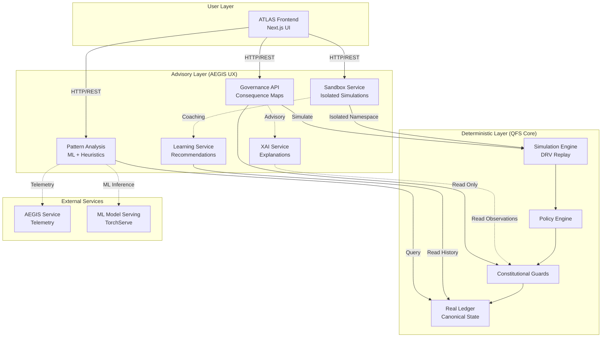

# AEGIS UX Architecture Overview

**Version:** 1.0  
**Status:** Draft  
**Last Updated:** 2025-12-17  
**Owner:** QFS Architecture Team

---

## Purpose

This document defines the **system-wide architecture** for AEGIS-integrated UX/AI modules layered on top of the QFS × ATLAS deterministic stack. It establishes:

1. **Architectural principles** that preserve QFS determinism while enabling AI-driven UX
2. **Component boundaries** between deterministic core and advisory AI layer
3. **Data flow patterns** for governance, simulation, pattern analysis, and learning
4. **Integration points** with existing QFS, ATLAS, and AEGIS infrastructure
5. **Security and compliance constraints** for AI advisory systems

**Scope:** All AEGIS UX features across 3 implementation phases:

- Phase 1: Governance UX (Consequence Maps, Reflection Panels, Symbolic Interfaces)
- Phase 2: Sandbox & Pattern Analysis (Interactive Exploration, AI Coaching)
- Phase 3: Learning Loops & XAI (Personalized Learning, Advanced Explanations)

---

## Architectural Principles

### AP-1: Deterministic Core, Advisory Layer

**Principle:** All economic and governance *decisions* remain purely deterministic. AEGIS provides *explanations, predictions, and recommendations* only.

**Enforcement:**

- AEGIS services have **read-only** access to QFS state
- No AEGIS output can directly mutate balances, guards, or policies
- All AEGIS recommendations are logged as **advisory metadata**, separate from deterministic audit trail

**Boundary:**

```
┌─────────────────────────────────────────────────┐
│  DETERMINISTIC LAYER (QFS Core)                 │
│  - Guards enforce economics                     │
│  - Ledger stores canonical state                │
│  - CertifiedMath guarantees reproducibility     │
│  ✅ WRITE access to economic state              │
└─────────────────────────────────────────────────┘
                    ↕ READ ONLY ↕
┌─────────────────────────────────────────────────┐
│  ADVISORY LAYER (AEGIS UX)                      │
│  - Explains why guards fired                    │
│  - Predicts proposal consequences               │
│  - Recommends learning paths                    │
│  ❌ NO WRITE access to economic state           │
└─────────────────────────────────────────────────┘
```

### AP-2: Offline-First, Graceful Degradation

**Principle:** All AEGIS UX features must function with cached/snapshot data if live AEGIS service is unavailable.

**Implementation:**

- Telemetry snapshots (hash-anchored, versioned) cached locally
- Governance consequence maps use deterministic simulation (no live AI needed)
- Pattern analysis degrades to rule-based heuristics if ML service offline

**Existing Support:** `aegis_api.py` already implements offline mode with `AEGISOfflineError` handling.

### AP-3: Replay-Verifiable Evidence

**Principle:** Every AEGIS recommendation must be traceable to deterministic inputs (proof vectors, simulation runs, ledger hashes).

**Requirements:**

- AEGIS outputs include `pqc_cid` linking to deterministic context
- All sandbox runs produce reproducible hashes
- Pattern analysis stores query parameters + data snapshot hashes

### AP-4: Zero-Simulation Compliance for Core Operations

**Principle:** AEGIS UX must not introduce randomness, wall-clock time, or floating-point math into economic calculations.

**Allowed in AEGIS Layer (advisory only):**

- ML model inference (for recommendations, not decisions)
- Natural language generation (for explanations)
- Statistical analysis of historical patterns

**Forbidden in AEGIS Layer:**

- Direct economic mutations
- Guard bypasses
- Unlogged state changes

### AP-5: Progressive Disclosure, Minimal Cognitive Load

**Principle:** Advanced AEGIS features (what-if scenarios, pattern queries) are opt-in. Default UX shows simple explanations.

**UX Pattern:**

- **Level 1 (Default):** "Your reward was X because of Y" (Explain-This)
- **Level 2 (Intermediate):** "This guard fired due to Z condition" (Consequence Map)
- **Level 3 (Advanced):** "Run sandbox to explore parameter changes" (Interactive Sandbox)

---

## System Architecture

### High-Level Component View



**Key:**

- Solid lines (→): Data flow, API calls
- Dashed lines (-.->): Advisory/optional services
- Read Only: Cannot mutate state
- Isolated Namespace: Sandboxed execution

### Data Flow Patterns

#### Pattern 1: Governance Consequence Map

**User Action:** View impact of governance proposal

```
User submits proposal parameters
    ↓
ATLAS → Governance API: POST /governance/consequence-map
    ↓
Governance API calls Simulation Engine with proposal params
    ↓
Simulation Engine creates isolated DRV_Packet sequence
    ↓
Simulation runs against current Guards + Ledger snapshot
    ↓
Simulation Engine returns: affected guards, state deltas, proof hashes
    ↓
Governance API queries AEGIS for risk scores (optional, cached if offline)
    ↓
XAI Service generates explanation of guard interactions
    ↓
API returns: ConsequenceGraph + AI annotations
    ↓
ATLAS renders interactive graph with risk badges
```

**Determinism Guarantee:** Same proposal + same ledger state → same consequence graph (AI annotations may vary but core graph is deterministic).

#### Pattern 2: Sandbox Scenario Execution

**User Action:** Run "what-if" scenario in sandbox

```
User selects scenario template + edits parameters
    ↓
ATLAS → Sandbox API: POST /sandbox/create
    ↓
Sandbox Service creates isolated namespace (Docker container or K8s namespace)
    ↓
    ↓
ATLAS → Sandbox API: POST /sandbox/{id}/execute
    ↓
Sandbox runs DRV_Packet replay with user parameters in isolated context
    ↓
Sandbox collects: state snapshots, guard events, economic outcomes
    ↓
Sandbox Service calls Pattern Analysis: "Find similar historical runs"
    ↓
Pattern Analysis returns: top-k similar scenarios
    ↓
AEGIS Mentor generates hints based on patterns
    ↓
API returns: SandboxResults + AI coaching
    ↓
ATLAS displays results + mentor panel
```

**Isolation Guarantee:** Sandbox state never affects RealLedger. Namespace destroyed after scenario completes.

#### Pattern 3: Pattern-Based Learning Recommendation

**User Action:** Complete governance action or tutorial

```
User completes interaction (e.g., reviews consequence map)
    ↓
ATLAS → Learning API: POST /learning/interactions
    ↓
Learning Service logs interaction with topic tags
    ↓
Learning Service queries user's LearningProfile
    ↓
Recommendation Engine analyzes: completed topics, skill level, recent errors
    ↓
Recommendation Engine calls Pattern Analysis: "Find knowledge gaps"
    ↓
Pattern Analysis returns: recommended next modules
    ↓
API returns: RecommendationList
    ↓
ATLAS displays "Next Steps" panel
```

**Privacy Guarantee:** All user interaction data is anonymized before storage. No PII in pattern analysis.

---

## Component Specifications

### 1. Governance API Service

**Purpose:** Provide governance consequence maps, reflection data, symbolic interfaces

**Responsibilities:**

- Execute deterministic simulations of governance proposals
- Extract guard dependencies and affected modules
- Link proposals to constitutional principles
- Query AEGIS for risk scores (with offline fallback)

**Technology:**

- Language: Python (FastAPI) or Rust (Axum)
- Data: PostgreSQL for proposal metadata (non-authoritative)
- Cache: Redis for consequence graph caching

**Key Endpoints:**

- `POST /governance/consequence-map` - Impact analysis
- `POST /governance/what-if` - Scenario simulation
- `GET /governance/principles/{action_id}` - Principle metadata
- `GET /governance/guards/{guard_id}/history` - Guard activation patterns

**Dependencies:**

- Simulation Engine (QFS core)
- Guards (read-only)
- AEGIS Service (optional, cached)

### 2. Sandbox Orchestration Service

**Purpose:** Isolated execution environment for user scenarios

**Responsibilities:**

- Create/destroy isolated namespaces
- Run DRV_Packet replay with user parameters
- Enforce resource limits (CPU, memory, time)
- Generate sandbox-specific proof hashes

**Technology:**

- Isolation: Docker containers (Phase 1-2) → Kubernetes namespaces (Phase 3)
- Orchestration: Custom Python service or K8s CRDs
- Storage: Ephemeral volumes, destroyed post-execution

**Key Endpoints:**

- `POST /sandbox/create` - Create sandbox
- `POST /sandbox/{id}/execute` - Run scenario
- `GET /sandbox/{id}/results` - Fetch results
- `DELETE /sandbox/{id}` - Terminate sandbox

**Security:**

- No network access from sandbox (air-gapped)
- Read-only access to RealLedger snapshots
- Strict CPU/memory/time quotas

### 3. Pattern Analysis Service

**Purpose:** Detect patterns in governance actions, guard activations, economic flows

**Responsibilities:**

- Index historical ledger events + guard observations
- Compute similarity between scenarios (vector embeddings)
- Detect anomalies (statistical + ML-based)
- Provide "find similar" queries for sandbox/learning

**Technology:**

- Language: Python (scikit-learn, sentence-transformers)
- Vector DB: Weaviate or Qdrant for embeddings
- Time-Series DB: TimescaleDB for anomaly detection
- ML Models: Self-hosted (TorchServe) or API-based

**Key Endpoints:**

- `POST /patterns/query` - Semantic search over patterns
- `GET /patterns/anomalies` - Real-time anomaly scores
- `GET /patterns/similar-events` - Historical similarity
- `POST /patterns/index` - Index new patterns (admin only)

**ML Pipeline:**

1. **Data Collection:** Ledger events → structured logs
2. **Feature Engineering:** Extract guard activation vectors, economic deltas
3. **Embedding:** Sentence-BERT for text, custom encoder for numeric features
4. **Indexing:** Store in vector DB with metadata (block height, proof hash)
5. **Inference:** Query-time similarity search + ML-based scoring

### 4. XAI (Explainable AI) Service

**Purpose:** Generate natural language explanations for AEGIS recommendations

**Responsibilities:**

- Explain guard firing reasons (feature importance)
- Narrate state transitions (archetypal diagrams)
- Provide sensitivity analysis (parameter perturbations)
- Generate "why this recommendation" tooltips

**Technology:**

- NLG: Template-based (Phase 1-2) → GPT-4/Claude API (Phase 3)
- Feature Importance: SHAP or custom attribution
- Templates: Mustache/Jinja2 for deterministic narratives

**Key Endpoints:**

- `POST /xai/explain-decision` - Explain AEGIS output
- `GET /xai/feature-importance` - Attribution scores
- `POST /xai/sensitivity` - Parameter sensitivity analysis
- `POST /xai/narrative` - Generate state transition story

**Constraints:**

- XAI outputs are advisory metadata only
- All explanations link to deterministic proof vectors
- NLG does not hallucinate; grounded in real data

### 5. Learning & Recommendation Service

**Purpose:** Track user progress, recommend personalized learning paths

**Responsibilities:**

- Log user interactions (anonymized)
- Maintain learning profiles (completed modules, skill assessments)
- Generate reflection prompts based on recent actions
- Recommend tutorials/sandbox scenarios

**Technology:**

- Language: Python (FastAPI)
- Storage: PostgreSQL for profiles (encrypted)
- Recommendation: Rule-based (Phase 1-2) → Collaborative filtering (Phase 3)

**Key Endpoints:**

- `POST /learning/interactions` - Log interaction
- `GET /learning/profile` - User learning state
- `GET /learning/recommendations` - Next steps
- `GET /learning/reflection-prompts` - Contextual prompts

**Privacy:**

- All interaction data anonymized before indexing
- No PII in recommendations or pattern analysis
- User can delete learning profile anytime

---

## Integration with Existing QFS Infrastructure

### Leveraging Existing Components

| QFS Component | AEGIS UX Usage |
|---------------|----------------|
| `DRV_Packet` replay | Sandbox deterministic simulation |
| `CertifiedMath` | All sandbox calculations (Zero-Sim compliant) |
| `AEGISGuard` observations | Pattern analysis input, XAI source data |
| `aegis_api.py` snapshots | Telemetry caching, offline mode |
| Explain-This framework | Extend for governance explanations |
| Constitutional Guards | Consequence map source of truth |
| `SessionManager` | Link learning profiles to sessions |
| Structured logging | XAI metadata extraction |

### New Dependencies

**Required:**

- **Simulation Engine API:** Formalize `DRV_Packet` replay as callable service
- **Guard Metadata Schema:** Explicit principle annotations on guards
- **Sandbox Namespace Manager:** Docker/K8s orchestration layer

**Optional:**

- **AEGIS Production Service:** Real-time telemetry (can use cached snapshots)
- **ML Model Registry:** Versioned pattern detection models
- **Vector Database:** For pattern similarity (can start with PostgreSQL + pgvector)

---

## Security & Compliance

### Threat Model

**Threats:**

1. **AI Recommends Economically Harmful Action**
   - Mitigation: Advisory only, Guards still enforce
   - Detection: Monitor for AEGIS-recommended actions that fail guards

2. **Sandbox Escape**
   - Mitigation: Strict namespace isolation, resource quotas
   - Detection: Process monitoring, syscall auditing

3. **AEGIS Service Compromise**
   - Mitigation: Offline mode, snapshot verification
   - Detection: Hash mismatch on telemetry snapshots

4. **User Data Leakage in Pattern Analysis**
   - Mitigation: Anonymization, no PII indexing
   - Detection: Audit logs for pattern queries

### Compliance Requirements

**Zero-Simulation Compliance:**

- ✅ Governance API: Uses deterministic simulation (DRV replay)
- ✅ Sandbox: Isolated deterministic execution
- ❌ Pattern Analysis: ML inference allowed (advisory layer)
- ❌ XAI Service: NLG allowed (advisory layer)
- ✅ Learning Service: Rule-based recommendations (deterministic)

**AEGIS Advisory Contract:**

- All AEGIS outputs tagged as `advisory: true` in API responses
- No AEGIS recommendation can bypass authentication or guards
- All AEGIS-influenced decisions logged separately from deterministic audit trail

**Data Privacy:**

- No PII in pattern analysis embeddings
- Learning profiles encrypted at rest
- User consent required for interaction logging

---

## Deployment Architecture

### Phase 1 Deployment (Governance UX)

```
┌─────────────────────────────────────────┐
│  ATLAS Frontend (Next.js)               │
│  - Consequence Map UI                   │
│  - Reflection Panel UI                  │
│  - Token/Guard Map UI                   │
└─────────────────────────────────────────┘
            ↓ HTTPS/REST ↓
┌─────────────────────────────────────────┐
│  Governance API Service                 │
│  - FastAPI/Axum                         │
│  - Deployed: Docker container           │
│  - Scale: 2 replicas (HA)               │
└─────────────────────────────────────────┘
            ↓
┌─────────────────────────────────────────┐
│  QFS Core (Existing)                    │
│  - Guards, Ledger, Simulation           │
└─────────────────────────────────────────┘
            ↓
┌─────────────────────────────────────────┐
│  PostgreSQL (Existing)                  │
│  - Proposal metadata (non-authoritative)│
└─────────────────────────────────────────┘
```

**Infrastructure:**

- Governance API: Single service, stateless
- No new databases (use existing PostgreSQL)
- AEGIS telemetry: Cached snapshots (offline mode)

### Phase 2 Deployment (Sandbox + Patterns)

**Additions:**

- **Sandbox Orchestrator:** K8s namespace manager
- **Pattern Analysis Service:** Python + Vector DB
- **Redis Cache:** For simulation results

### Phase 3 Deployment (Full UX)

**Additions:**

- **XAI Service:** NLG + ML models
- **Learning Service:** Recommendation engine
- **ML Model Serving:** TorchServe cluster

---

## Performance & Scalability

### Target Metrics

| Operation | Target Latency | Target Throughput |
|-----------|----------------|-------------------|
| Consequence Map API | <2s p95 | 50 req/s |
| Sandbox Execution | <10s p95 | 10 concurrent |
| Pattern Query | <1s p95 | 100 req/s |
| XAI Explanation | <500ms p95 | 200 req/s |

### Scalability Strategy

**Stateless Services:**

- Governance API, XAI Service: Horizontal scaling (add replicas)
- Pattern Analysis: Shard vector DB by time range

**Stateful Services:**

- Sandbox Orchestrator: Limit concurrent sandboxes per node
- Learning Service: Partition by user ID hash

**Caching:**

- Consequence graphs (1 hour TTL, invalidate on policy changes)
- Pattern query results (24 hour TTL)
- AEGIS telemetry snapshots (permanent, keyed by block height)

---

## Monitoring & Observability

### Metrics to Track

**Service Health:**

- Governance API: Request rate, error rate, latency (p50, p95, p99)
- Sandbox Service: Active sandboxes, execution time, namespace creation failures
- Pattern Service: Query latency, vector DB index size, ML model accuracy

**Business Metrics:**

- Consequence map views per governance proposal
- Sandbox scenario executions per user
- Pattern analysis query success rate
- Learning recommendations accepted (click-through rate)

**Security Metrics:**

- AEGIS advisory boundary violations (should be 0)
- Sandbox escape attempts (should be 0)
- Telemetry snapshot hash mismatches

### Alerting

**Critical Alerts:**

- AEGIS Service offline >5 minutes (switch to cached mode)
- Sandbox namespace leakage detected
- Determinism violation (sandbox hash mismatch on replay)

**Warning Alerts:**

- Governance API latency >5s p95
- Pattern analysis ML model accuracy drop >10%
- Learning service recommendation acceptance <30%

---

## Testing Strategy

### Unit Tests

**Coverage Target:** >90% for all new services

**Focus Areas:**

- Deterministic simulation logic (consequence maps)
- Sandbox isolation (namespace creation/destruction)
- AEGIS advisory boundary enforcement
- XAI explanation generation (template correctness)

### Integration Tests

**Scenarios:**

1. **Governance Flow:** Submit proposal → view consequence map → simulate what-if → verify hash stability
2. **Sandbox Flow:** Create sandbox → execute scenario → retrieve results → verify isolation
3. **Pattern Flow:** Index historical data → query patterns → verify similarity scores
4. **Offline Mode:** Disable AEGIS service → verify cached snapshots used → verify UX degrades gracefully

### End-to-End Tests

**User Journeys:**

1. User reviews governance proposal, sees consequence map, reflection panel works
2. User creates sandbox scenario, runs simulation, receives AEGIS coaching
3. User completes tutorial, learning timeline updates, receives next recommendations

### Determinism Tests

**Critical Requirement:** All governance and sandbox operations must be replay-verifiable

**Test Pattern:**

```python
# Run consequence map twice with same inputs
result1 = governance_api.consequence_map(proposal_params, ledger_snapshot)
result2 = governance_api.consequence_map(proposal_params, ledger_snapshot)

# Core graph must be identical (AI annotations may differ)
assert result1.graph_hash == result2.graph_hash
assert result1.affected_guards == result2.affected_guards
```

---

## Roadmap Alignment

### Phase 1 (Months 1-4): Governance Foundation

**Components to Build:**

- Governance API Service (consequence maps, reflection, symbolic map)
- Extend existing Explain-This for governance schemas
- No ML required (rule-based only)

**Architecture Focus:**

- Establish AEGIS advisory boundary
- Implement deterministic simulation API
- Define guard metadata schema

### Phase 2 (Months 4-8): Sandbox & Patterns

**Components to Build:**

- Sandbox Orchestration Service
- Pattern Analysis Service (basic, rule-based heuristics)
- AEGIS Mentor (simple hints, no ML)

**Architecture Focus:**

- Sandbox isolation (Docker containers)
- Pattern indexing infrastructure
- Real-time AEGIS telemetry integration (if available)

### Phase 3 (Months 8-12): Learning & XAI

**Components to Build:**

- XAI Service (ML-based feature importance)
- Learning & Recommendation Service
- Narrative Generation Service

**Architecture Focus:**

- ML model deployment (TorchServe)
- Advanced pattern analysis (vector embeddings)
- Production hardening (load balancing, HA)

---

## Open Questions & Decisions Needed

### Q1: AEGIS Service API Contract

**Status:** Not yet defined  
**Decision Needed:** gRPC vs REST, authentication method, data schemas  
**Blocker for:** Phase 2 real-time telemetry  
**Timeline:** Resolve by Week 2

### Q2: Sandbox Isolation Technology

**Options:**

- A) Docker containers (simpler, Phase 1-2)
- B) Kubernetes namespaces (production-grade, Phase 3)
- C) Process-level isolation (lightweight, limited security)

**Decision Needed:** Choose A or B  
**Timeline:** Resolve by Week 3 (inform Sandbox Architecture Spec)

### Q3: ML Model Hosting

**Options:**

- A) Self-hosted (TorchServe, full control)
- B) External API (OpenAI, Claude for NLG only)
- C) Hybrid (self-host pattern models, API for NLG)

**Decision Needed:** Choose based on budget, data privacy requirements  
**Timeline:** Resolve by Month 3 (before Phase 3)

### Q4: Learning Profile Storage

**Options:**

- A) PostgreSQL (existing, encrypted)
- B) Separate user service database
- C) Client-side localStorage (most private, limited features)

**Decision Needed:** Privacy vs feature richness tradeoff  
**Timeline:** Resolve by Month 6 (before Phase 3)

---

## References

- [AEGIS Gap Analysis](file:///C:/Users/Usuario/.gemini/antigravity/brain/44e3a64d-5d10-4fce-9f26-05fbec0679a6/aegis_gap_analysis.md) - Implementation roadmap
- [Repository Status Report](file:///C:/Users/Usuario/.gemini/antigravity/brain/44e3a64d-5d10-4fce-9f26-05fbec0679a6/repository_status_report.md) - Current QFS state
- [Zero-Sim Contract](file:///d:/AI%20AGENT%20CODERV1/QUANTUM%20CURRENCY/QFS/V13/v13/docs/ZERO_SIM_QFS_ATLAS_CONTRACT.md) - Determinism requirements
- [Existing AEGIS API](file:///d:/AI%20AGENT%20CODERV1/QUANTUM%20CURRENCY/QFS/V13/v13/services/aegis_api.py) - Current implementation
- [AEGIS Guard](file:///d:/AI%20AGENT%20CODERV1/QUANTUM%20CURRENCY/QFS/V13/v13/guards/AEGISGuard.py) - Observation infrastructure

---

## Revision History

| Version | Date | Author | Changes |
|---------|------|--------|---------|
| 1.0 | 2025-12-17 | QFS Architecture Team | Initial draft based on gap analysis |

---

**Next Document:** [AEGIS Advisory Boundaries Contract](AEGIS_ADVISORY_CONTRACT.md) (P0-2)
